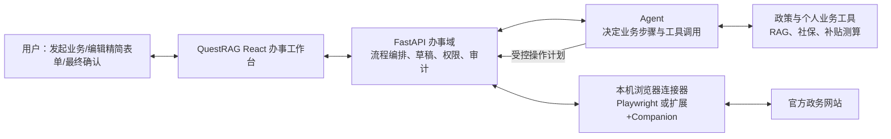

# QuestRAG 浏览器政务办事 Agent 实施计划

> 状态：MVP 已实施（本地受控 mock 适配器）；真实政务站点尚待业务授权与适配。  
> 目标：把 QuestRAG 从“政策问答与资格测算助手”演进为“Agent 主导办事流程、用户编辑精简表单、后台浏览器同步官方页面”的公共服务办事助手。当前 MVP 模拟“就业登记申请”。

## 1. 已确认的产品决策

本计划以以下决策为前提，不再把它们作为待选方案：

1. 用户只需发起一项业务，例如“办理就业登记”；由 Agent 判断后续步骤、选择官方站点及表单入口，用户不需要自行寻找网页。
2. Agent 在流程中调用浏览器能力打开、读取并填写官方页面；这不是一个独立的浏览器测试功能。
3. QuestRAG 面向用户只展示当前业务所需的**精简表单区域**，不嵌入官方站点的导航、广告、侧栏或无关内容。
4. 用户可以直接编辑、补填和上传这份精简表单；每次修改都是申请草稿的正式变更，并与后台官方页面同步。
5. 用户手工编辑优先级最高。Agent 可以预填、解释、提示冲突，但不得静默覆盖用户已编辑的值。
6. 验证码、人脸核验、电子签名、声明承诺和最终提交必须暂停并由用户亲自完成。Agent 可以导航至该步骤、展示必要提示和读取完成结果。
7. “由 Agent 决定页面”不等于“允许模型任意访问网络”。生产办事模式只能在已登记的业务流程、官方域名、路径和站点适配器中决策。

## 2. 现有基础与改造边界

### 2.1 可复用的现有能力

| 现有能力 | 现有位置 | 在新能力中的用途 |
| --- | --- | --- |
| FastAPI 应用与启动初始化 | `quest_rag/main.py` | 注册办事、浏览器连接和后台同步 API；初始化新表。 |
| Agent + 工具调用 | `quest_rag/rag/generator.py`、`quest_rag/rag/tools.py` | Agent 选择业务、补充信息、调用受控办事工具。 |
| 工具权限二次校验 | `quest_rag/rag/tool_registry.py` | 浏览器读页、填表、上传均按权限、数据范围和风险级别校验。 |
| 身份、JWT、Redis 会话、操作日志 | `quest_rag/auth/` | 绑定申请人、浏览器连接授权和审计记录。 |
| 社保查询、补贴匹配/测算 | `quest_rag/social_security/`、`quest_rag/subsidy/` | 作为资格初筛与预填的业务工具；现有 mock 数据不能当作真实经办数据。 |
| React + Ant Design 前端与 SSE 对话 | `web/src/`、`quest_rag/api/chat.py` | 增加“办事工作台”和 Agent 状态流。 |
| PostgreSQL JSONB 与评测追踪 | 现有 store / evaluation 模块 | 保存 schema、草稿、字段来源、浏览器动作及回归样本。 |

### 2.2 本期不做的事情

- 不承诺接入所有地区、所有政务网站或自动绕过验证码、登录、人脸核验。
- 不把官方网页以 `iframe` 原样嵌入 QuestRAG；多数站点会禁止跨站嵌入，也不符合“只展示表单”的体验目标。
- 不让 LLM 根据网页自然语言自行拼接任意 URL、执行任意脚本或在未知页面上传任意文件。
- 不把“浏览器能够点通”当作“业务结果正确”。资格、材料和流程仍需有版本化规则、政策证据与回归测试。

## 3. 目标体验

用户发起“办理就业登记”后，看到的是一个办事工作台，而非完整政府网站：

```text
就业登记申请 · 第 2/5 步：填写就业信息
官方服务：某市人社服务平台 · 已安全连接

姓名              [ 张三                    ]  官方只读
联系电话          [ 138xxxxxxxx              ]  可编辑
就业类型          [ 单位就业 v                ]  可编辑
就业起始日期      [ 2026-07-01               ]  可编辑

缺少材料：劳动合同、营业执照或灵活就业证明
[ 上传材料 ]

Agent 提示：联系电话与历史资料不一致，请确认。
已同步 4/5 项到官方表单 · 保存草稿 · 继续下一步
```

用户能修改可编辑字段、上传材料、保存并继续。后台浏览器会被 Agent 导航到相应官方表单，同步后返回真实页面状态。页面进入验证码、承诺或提交时，工作台只展示必要的官方确认区域、官方域名和下一步提示，要求用户自行操作。

## 4. 总体架构



### 4.1 责任划分

| 层 | 负责什么 | 不负责什么 |
| --- | --- | --- |
| Agent | 选择已登记业务的下一步、发起资格核验、提出预填建议、决定何时读取/同步官方表单 | 直接执行任意 URL、覆盖手工值、确认承诺或提交申请 |
| 办事域服务 | 校验状态机、解析流程定义、生成操作计划、记录草稿与审批、拒绝越权调用 | 依靠模型自由推断页面选择器 |
| 浏览器连接器 | 在本机官方站点执行打开、读取、点击、填表和受控上传；返回结构化结果 | 保存用户密码/Cookie 到服务端、绕过身份验证 |
| 站点适配器 | 官方域名/路径、页面识别、字段映射、成功/错误判断 | 放宽到任意第三方页面 |
| 精简表单 UI | 渲染 schema、收集用户编辑、展示同步/冲突/材料状态 | 直接嵌入整张外部网页 |

## 5. 关键技术方案

### 5.1 浏览器执行：本机运行，不在服务端托管用户会话

常规 React 网页无法安全控制用户任意已打开的 Chrome 标签页。因此浏览器执行器必须运行在用户本机。分两阶段建设：

1. **MVP：本机 Playwright 连接器**
   - 新增 Python `playwright` 依赖，连接器在用户本机启动专用 Chromium profile。
   - FastAPI 仅创建短时有效的任务和操作计划；连接器通过 WebSocket 拉取计划、返回页面状态与动作结果。
   - 适合用受控测试站点或单一试点站点验证流程、表单同步和人工确认。
2. **产品化：Chrome 扩展 + 本机 Companion**
   - Chrome 扩展只申请已登记官方域名的 `host_permissions`，通过 content script 读取 DOM、定位字段、执行点击/输入。
   - Companion 通过 Native Messaging 处理本地文件选择、加密和与 QuestRAG 的认证通信。
   - Cookie、登录态和用户本地文件不上传到 FastAPI；服务端只获得脱敏后的页面结构、任务状态和用户明确允许同步的字段值。

浏览器自动化优先采用 DOM/可访问性树和已验证选择器；截图与视觉模型只用于页面结构发生变化时的受控辅助诊断，不作为金额、身份证号、声明文字或提交按钮的唯一判断依据。

### 5.2 站点适配器和流程注册表

每个接入业务必须有版本化配置，核心不是让 Agent 存储网址，而是让业务步骤绑定已审核的站点适配器。推荐新增 `quest_rag/applications/`：

```text
applications/
  schemas.py             # Pydantic 请求/响应与 schema 模型
  store.py               # PostgreSQL 表、草稿和审计访问
  workflow_service.py    # 状态机、字段优先级、操作计划
  adapter_registry.py    # 业务/地区/版本 -> 站点适配器
  policy_service.py      # 资格核验、证据版本与材料清单
browser_runtime/
  protocol.py            # FastAPI 与本机连接器的消息协议
  service.py             # 连接器注册、任务分发、结果验收
  adapters/              # 每个官方站点的页面适配实现
```

流程定义至少包含：`business_code`、地区、有效期、步骤图、表单 schema 版本、所需材料、政策证据版本、可跳转的步骤和每个步骤的 `adapter_id`。适配器至少包含：允许域名、入口 URL、允许路径、预期页面标识、字段映射、只读字段、可执行动作、报错识别和成功标识。

Agent 不能调用 `open_url(url)`；它调用的是语义化工具，例如：

```text
start_application(business_code, region)
resolve_next_workflow_step(case_id)
open_workflow_step(case_id, step_code)
inspect_official_form(case_id)
sync_draft_to_official_form(case_id)
```

`open_workflow_step` 由服务端根据当前申请状态和适配器解析真实地址，并同时校验域名、路径、用户授权和前置状态。

### 5.3 表单 schema、草稿与双向同步

表单 schema 是业务定义；草稿是用户本次申请的数据，两者必须分离。schema 使用 Pydantic 模型校验并以 JSONB 保存，关键字段包括：

```json
{
  "field_key": "unemployed_since",
  "label": "失业登记日期",
  "type": "date",
  "required": true,
  "editable": true,
  "validators": [{"kind": "date_not_future"}],
  "visible_when": {"first_application": true},
  "official_mapping": {"adapter_id": "city_hrss_v1", "target": "unemployedSince"}
}
```

每个草稿字段都要保存以下元数据：

| 字段 | 含义 |
| --- | --- |
| `value_ciphertext` | 加密后的实际值；不在日志和普通 SSE 中输出。 |
| `source` | `user_manual`、`agent_suggested`、`profile_prefill`、`official_readonly` 或 `official_observed`。 |
| `revision` / `updated_at` | 处理并发编辑和陈旧浏览器页面。 |
| `sync_state` | `pending`、`synced`、`rejected`、`conflict`、`readonly`。 |
| `last_browser_value_hash` | 比较官方页面返回值，避免记录敏感原文。 |

同步规则：

1. 用户编辑先写入草稿并完成本地 schema 校验，再下发浏览器同步任务。
2. Agent 预填只能写入尚未有 `user_manual` 值的字段；若建议与用户值不同，创建 `conflict` 提示，等待用户选择。
3. 浏览器读取到官方只读/自动计算值时，保留为 `official_observed`，不反向覆盖用户可编辑草稿。
4. 官方页面拒绝值时，将具体字段标为 `rejected` 并显示官方错误；用户可修改后重试。
5. 表单 schema 更新时，旧申请仍绑定原版本；迁移只生成“需要重新确认”的差异清单，绝不静默改变历史申请。

### 5.4 精简表单 UI

新增路由及独立组件目录：

```text
web/src/features/applications/
  ApplicationWorkspace.tsx
  DynamicForm.tsx
  FormField.tsx
  MaterialPanel.tsx
  SyncStatus.tsx
  ConflictDialog.tsx
  ApprovalDialog.tsx
  application-api.ts
  application.css
```

界面只显示当前步骤的字段、材料、校验与同步状态。外部页面不会 `iframe` 进来。若用户需核验官方声明或最终回执，显示经适配器截取的相关区域和清晰的官方域名，而非整站 UI。

Agent 的对话状态经 SSE 单独显示，例如“正在判断资格”“正在打开补贴申请表”“官方页面要求补充材料”。字段修改、同步结果和审批状态使用结构化事件，不能依赖模型输出的 Markdown 解析。

### 5.5 Agent 工具、权限和人工确认

现有工具注册表已区分权限和风险等级。新增权限建议：

```text
application.case.create
application.case.read_self
application.case.edit_self
application.browser.connect
llm.tool.application_workflow_read
llm.tool.application_form_sync
application.user_confirm_sensitive_change
```

风险分级如下：

| 工具/动作 | 风险 | 是否自动执行 |
| --- | --- | --- |
| 查看已登记流程、读取当前表单结构、检查缺件 | LOW | 可以。 |
| 进入已登记官方入口、读取表单值 | MEDIUM | 可以，需当前申请和浏览器连接授权。 |
| 同步普通字段、上传已选定材料 | HIGH | 每次操作计划需用户确认；根据后续试点结果再考虑“已授权字段自动同步”。 |
| 发送验证码、确认声明、电子签名、最终提交 | CRITICAL | 不注册为 Agent 执行工具；只能提示并等待用户在官方页面完成。 |

除 RBAC 外，必须同时满足“该申请归属当前用户”“当前浏览器连接属于该用户”“当前状态允许此动作”“用户已授权本次计划”四道校验。所有拒绝也要写审计日志。

### 5.6 数据与隐私

在 PostgreSQL 新增以下核心实体：

| 表 | 用途 |
| --- | --- |
| `application_definition` / `application_definition_version` | 业务、地区、流程、schema、材料和政策版本。 |
| `application_case` | 用户的一次申请和当前状态。 |
| `application_draft_field` | 加密字段值、来源、版本、同步状态。 |
| `application_attachment` | 用户明确选择的材料、哈希、用途、保留期和上传状态。 |
| `application_browser_connection` | 本机连接器注册、设备公钥/短时令牌、有效期；不存 Cookie。 |
| `application_browser_run` / `application_browser_action` | 操作计划、动作结果、页面标识、字段哈希、失败原因。 |
| `application_approval` | 用户对敏感同步、声明和继续步骤的确认记录。 |

敏感字段与附件使用独立数据加密密钥；数据库、日志、监控、SSE 和 LLM 输入默认传递脱敏值。身份证号等已有身份数据继续保持摘要检索、密文存储的边界。截图仅在用户同意且确有审计必要时加密保存，设置严格的用途与保留期。

## 6. API 与连接器协议

所有新增业务 API 使用语义化 POST 路径和 JSON 请求体。初步接口如下：

```text
POST /applications/definitions/list
POST /applications/cases/create
POST /applications/cases/get
POST /applications/cases/next-step
POST /applications/drafts/update-field
POST /applications/drafts/get
POST /applications/materials/upload
POST /applications/sync/plan
POST /applications/sync/approve
POST /applications/browser/connect
POST /applications/browser/observe
POST /applications/browser/action-result
POST /applications/approvals/confirm
POST /applications/cases/official-result
```

浏览器连接器与服务端使用带设备身份的 WebSocket 或长轮询。每个操作计划必须包含：`run_id`、`case_id`、`adapter_id`、允许域名/路径、前置页面指纹、动作列表、字段哈希引用、过期时间和一次性签名。连接器必须在执行前再次核验这些约束；过期、跨域、页面指纹不符或连续跳转异常时停止并上报，不能自行扩大权限。

## 7. 实施阶段

### 阶段 0：业务和试点边界确认

选择**一个城市、一个业务、一个官方站点**作为试点。建议优先选择“就业补贴申请预填”，因为项目已有补贴匹配/测算基础。确认官方测试环境、授权范围、目标页面、登录/验证码规则、申请材料和成功回执定义。输出适配器验收清单。

### 阶段 1：办事域、草稿与精简表单（不接真实浏览器）

1. 建立 `applications` 数据模型、迁移和 schema 校验。
2. 将一个试点业务的流程、材料与字段写为版本化定义。
3. 实现动态表单、草稿保存、字段来源、冲突提示与附件选择。
4. 接入现有补贴/社保工具作为只读资格核验，清晰标注 mock 与正式数据边界。
5. 增加工具权限和操作日志，Agent 仅能创建/阅读案例、提出预填建议。

验收：用户能在 QuestRAG 内发起一份申请、编辑表单、保存恢复草稿、看到资料缺口和字段来源；没有浏览器也能完整体验资料准备流程。

### 阶段 2：本机 Playwright 浏览器连接器 POC

1. 在 `pyproject.toml` 添加可选浏览器运行时和安装指引；提供本机启动命令。
2. 实现连接器注册、短时令牌、心跳、操作计划与结果回传。
3. 为试点站点实现首个适配器：入口、页面识别、字段映射、读页、填表和错误读取。
4. 先用可控 mock 政务站点完成端到端测试，再在获授权条件下验证真实站点。
5. 打通“Agent 决定步骤 -> 服务端解析入口 -> 连接器打开 -> 读取表单 -> 用户编辑 -> 同步”的闭环。

验收：没有用户手动寻找入口的前提下，Agent 能在允许的试点站点进入正确表单；用户修改一个字段后，可看到同步成功、失败或冲突，不发生跨站访问。

### 阶段 3：高风险确认、材料和人工暂停

1. 增加敏感字段同步审批、材料用途绑定和上传前确认。
2. 实现验证码/人脸/声明/提交的 `WAITING_USER` 状态；这些步骤只展示必要官方区域及说明。
3. 增加官方错误、超时、网页改版、会话失效、用户手工改官方页面的恢复路径。
4. 完善审计查询、导出和保留/删除策略。

验收：任何 CRITICAL 操作均无法由 Agent 触发；所有 HIGH 操作都有相应授权和结果审计；断网、过期或页面不匹配时自动停止。

### 阶段 4：评测、灰度与扩展

1. 以“案例 -> Agent 工具调用 -> 浏览器动作 -> 字段同步 -> 用户确认 -> 官方结果”记录完整 trace。
2. 建立模拟站点回归集：必填缺失、条件联动、页面改版、会话失效、网页恶意提示、重复点击、官方校验失败。
3. 对试点用户灰度开放，收集字段修改率、同步成功率、人工接管率、完成率、错误恢复率和高风险动作拒绝率。
4. 试点稳定后，替换/补充为 Chrome 扩展 + Companion，并按站点逐个新增适配器。

## 8. 测试与验收标准

### 自动化测试

- 单元测试：schema 校验、字段优先级、草稿版本、状态机合法转换、权限拒绝、域名/路径白名单。
- 服务测试：全部新增 API 的用户归属校验、短时计划过期、连接器结果验收和审计完整性。
- Agent 测试：只能选择已登记业务和工具；用户手工字段不被覆盖；低权限账户看不到浏览器/填表工具。
- Playwright 模拟站点测试：正确入口、动态字段、错误消息、重定向、登录失效、页面指纹变化、重复同步。
- 安全测试：外部网页中的提示注入不能改变操作计划；跨域跳转、隐藏提交按钮、文件路径伪造与过期令牌都必须被拒绝。

### 试点验收

1. 用户从一句自然语言发起试点业务后，不用自行寻找官方入口。
2. 用户全程只在 QuestRAG 精简表单内完成常规编辑，且修改能正确同步到官方页面。
3. 用户改过的字段不会被 Agent 覆盖；冲突能解释来源并由用户决定。
4. 所有表单页面、同步结果和申请状态都能在中断后恢复。
5. 验证码、声明和提交没有任何自动化绕过路径。
6. 操作审计可定位到案例、流程版本、适配器版本、授权、字段哈希和浏览器结果，但不泄露明文敏感数据。

## 9. 主要风险与处理原则

| 风险 | 处理原则 |
| --- | --- |
| 政策或网站频繁变化 | 业务定义、政策证据、表单 schema、适配器独立版本化；页面指纹不匹配即暂停。 |
| 网页提示注入或恶意跳转 | 网页文本不是 Agent 指令；只接受适配器允许的结构化状态和操作。 |
| 浏览器会话泄露 | 会话仅留在本机浏览器；服务端使用短时、一次性签名计划，不保存 Cookie 或密码。 |
| 敏感信息泄露 | 字段/附件加密、默认脱敏、最小化进入 LLM、严格日志与保留期。 |
| 用户与官方页面的值冲突 | 字段来源、版本和哈希对比；用户手工值优先，冲突可见且可恢复。 |
| 错误提交或重复提交 | 状态机、人工最终提交、页面确认、幂等 run ID 与提交结果回读。 |

## 10. 首次实现的文件范围

预计新增：

```text
quest_rag/applications/
quest_rag/browser_runtime/
quest_rag/api/applications.py
web/src/features/applications/
tests/test_application_*.py
tests/browser_fixtures/
```

预计修改：

```text
quest_rag/main.py                    # 注册路由与初始化
quest_rag/rag/tools.py               # 注册办事语义工具
quest_rag/rag/tool_registry.py       # 权限、风险和二次校验
quest_rag/auth/permissions.py        # 权限目录与角色分配
pyproject.toml / uv.lock             # 浏览器运行时依赖
web/src/App.tsx                      # 入口与路由
```

不修改现有 RAG、社保或补贴核心语义来伪造真实经办数据；试点业务应在新办事域中组合调用这些现有只读能力。

## 11. 开工前唯一需要业务方确认的输入

开始实施前需要确认首个试点的：地区、业务名称、官方站点及可使用的测试/授权环境。其余架构可按本计划推进。若没有真实站点授权，先以 mock 政务站点完成阶段 1 和阶段 2 的全部技术闭环，不能将 mock 验证表述为真实政务办理验收。

## 12. 本次 MVP 实施记录（2026-08-12）

已实现：

- `quest_rag/applications/form_definitions/` 下的版本化 JSON 业务定义。新增标准表单只需新增定义文件；已有通用字段类型、草稿和同步机制不用修改代码。
- 就业登记申请的可恢复草稿、字段来源/修订号、用户修改优先、必填/日期/电话校验与同步确认。
- 材料上传、用户归属校验、操作日志、申请/草稿/材料/浏览器连接的 PostgreSQL 初始化。
- 受控 `mock.hrss.local` 演示适配器：入口只能由服务端从业务定义解析，不能由模型提供任意 URL。
- React 精简表单工作台。页面不嵌入官方整站；用户能编辑表单、上传材料、恢复申请和查看同步/安全状态。
- Agent 只能创建申请草稿或读取申请状态；浏览器填写、验证码、声明、签名和最终提交都没有作为 Agent 工具注册。
- 单元测试和浏览器 smoke test 已覆盖用户编辑、敏感同步确认和精简表单渲染。

未宣称完成：

- `mock.hrss.local` 不是实际人社网站，也尚未绑定用户的本机 Chrome/官方登录态。
- 真实站点接入必须先获得业务方指定地区、官方测试/授权环境和字段映射审核；之后实现独立的 Chrome 扩展 + Companion 或本机 Playwright 适配器，且逐站验证页面指纹、验证码和人工提交边界。
